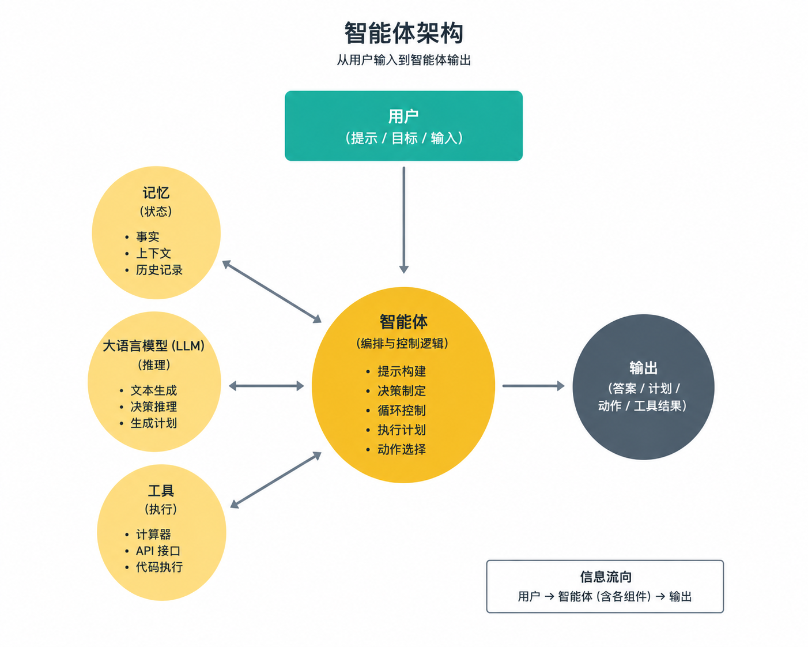

# 从零开始构建 AI 智能体

学习在本地构建 AI 智能体（Agent），不依赖任何框架。在使用生产级框架之前，先了解底层的工作原理。



## 目的

本仓库教你使用**本地大语言模型（LLM）**和 **node-llama-cpp** 从第一性原理出发构建 AI 智能体。通过这些示例的学习，你将理解：

- 大语言模型（LLM）在底层是如何工作的
- 智能体到底是什么（LLM + 工具 + 模式）
- 不同的智能体架构是如何运作的
- 框架为何做出某些设计选择


**理念**：通过构建来学习。深入理解，然后明智地使用框架。

## 配套网站

本仓库现在有一个**配套网站**：

**https://yuanjingteam.github.io/agent-zero/**

该网站**不是本仓库的替代品**，而是一个**概念性伴侣**，它可以：

- 解释每个示例*为什么*存在
- 可视化从原始 LLM 调用到完整智能体的学习路径
- 将**代码**、**解释**和**核心概念**分开呈现
- 帮助你在使用框架之前理解智能体架构

**推荐的工作流程：**

- 使用 **GitHub** 来运行、修改和研究代码
- 使用**网站**来获取思维模型、解释和学习进度

> 把网站看作*地图*，把本仓库看作*实地*。

## 智能体基础 - 从 LLM 到推理-行动（ReAct）

### 前提条件

- Node.js 18+
- 至少 8GB 内存（推荐 16GB）
- 下载模型并放置在 `./models/` 文件夹中，详情请参阅 [DOWNLOAD.md](DOWNLOAD.md)

### 安装

```bash
npm install
```

### 运行示例

```bash
node intro/intro.js
node simple-agent/simple-agent.js
node react-agent/react-agent.js
```

## 学习路径

按照以下示例的顺序学习，循序渐进地建立理解：

### 1. **入门** - 基本的 LLM 交互

`intro/` | [代码](examples/01_intro/intro.js) | [代码讲解](examples/01_intro/CODE.md) | [概念](examples/01_intro/CONCEPT.md)

**你将学到：**

- 加载并运行本地 LLM
- 基本的提示/响应循环

**核心概念**：模型加载、上下文（Context）、推理管道（Inference Pipeline）、令牌生成（Token Generation）

---

### 2. （可选）**OpenAI 入门** - 使用专有模型

`openai-intro/` | [代码](examples/02_openai-intro/openai-intro.js) | [代码讲解](examples/02_openai-intro/CODE.md) | [概念](examples/02_openai-intro/CONCEPT.md)

**你将学到：**

- 如何调用托管的 LLM（如 GPT-4）
- 温度控制（Temperature Control）
- 令牌使用量（Token Usage）

**核心概念**：推理端点（Inference Endpoints）、网络延迟、成本与控制的权衡、数据隐私、供应商依赖

---

### 3. **翻译** - 系统提示与专业化

`translation/` | [代码](examples/03_translation/translation.js) | [代码讲解](examples/03_translation/CODE.md) | [概念](examples/03_translation/CONCEPT.md)

**你将学到：**

- 使用系统提示（System Prompts）来专业化智能体
- 输出格式控制
- 基于角色的行为
- 针对不同模型的聊天包装器

**核心概念**：系统提示、智能体专业化、行为约束、提示工程（Prompt Engineering）

---

### 4. **思考** - 推理与问题解决

`think/` | [代码](examples/04_think/think.js) | [代码讲解](examples/04_think/CODE.md) | [概念](examples/04_think/CONCEPT.md)

**你将学到：**

- 配置 LLM 进行逻辑推理（Reasoning）
- 复杂的定量问题
- 纯 LLM 推理的局限性
- 何时使用外部工具

**核心概念**：推理智能体、问题分解、认知任务、推理局限性

---

### 5. **批处理** - 并行处理

`batch/` | [代码](examples/05_batch/batch.js) | [代码讲解](examples/05_batch/CODE.md) | [概念](examples/05_batch/CONCEPT.md)

**你将学到：**

- 并发处理多个请求
- 用于并行化的上下文序列（Context Sequences）
- GPU 批处理
- 性能优化

**核心概念**：并行执行、序列、批大小（Batch Size）、吞吐量优化

---

### 6. **编码** - 流式传输与响应控制

`coding/` | [代码](examples/06_coding/coding.js) | [代码讲解](examples/06_coding/CODE.md) | [概念](examples/06_coding/CONCEPT.md)

**你将学到：**

- 实时流式响应（Streaming Responses）
- 令牌限制和预算管理
- 渐进式输出显示
- 用户体验优化

**核心概念**：流式传输（Streaming）、逐令牌生成、响应控制、实时反馈

---

### 7. **简单智能体** - 函数调用（工具使用）

`simple-agent/` | [代码](examples/07_simple-agent/simple-agent.js) | [代码讲解](examples/07_simple-agent/CODE.md) | [概念](examples/07_simple-agent/CONCEPT.md)

**你将学到：**

- 函数调用（Function Calling）/ 工具使用基础
- 定义 LLM 可以使用的工具
- 用于参数的 JSON Schema
- LLM 如何决定何时使用工具

**核心概念**：函数调用、工具定义、智能体决策、执行动作

**这是文本生成转变为智能体（Agency）的关键一步！**

---

### 8. **带记忆的简单智能体** - 持久化状态

`simple-agent-with-memory/` | [代码](examples/08_simple-agent-with-memory/simple-agent-with-memory.js) | [代码讲解](examples/08_simple-agent-with-memory/CODE.md) | [概念](examples/08_simple-agent-with-memory/CONCEPT.md)

**你将学到：**

- 跨会话持久化信息
- 长期记忆管理
- 事实和偏好存储
- 记忆检索策略

**核心概念**：持久化记忆（Persistent Memory）、状态管理、记忆系统、上下文增强（Context Augmentation）

---

### 9. **推理-行动智能体（ReAct Agent）** - 推理 + 行动

`react-agent/` | [代码](examples/09_react-agent/react-agent.js) | [代码讲解](examples/09_react-agent/CODE.md) | [概念](examples/09_react-agent/CONCEPT.md)

**你将学到：**

- 推理-行动模式（ReAct Pattern）：推理 -> 行动 -> 观察
- 迭代式问题解决
- 分步工具使用
- 自我纠错循环

**核心概念**：推理-行动模式、迭代推理、观察-行动循环、多步骤智能体

**这是现代智能体框架的基础！**

---

### 10. **思维原子智能体（AoT Agent）** - 思维原子规划

`aot-agent/` | [代码](examples/10_aot-agent/aot-agent.js) | [代码讲解](examples/10_aot-agent/CODE.md) | [概念](examples/10_aot-agent/CONCEPT.md)

**你将学到：**

- 思维原子（Atom of Thought）方法论
- 用于多步骤计算的原子规划
- 操作之间的依赖管理
- 用于推理计划的结构化 JSON 输出
- 计划的确定性执行

**核心概念**：思维原子规划、原子操作、依赖解析、计划验证、结构化推理

---

### 11. **错误处理** - LLM + 工具的弹性

`error-handling/` | [代码](examples/11_error-handling/error-handling.js) | [代码讲解](examples/11_error-handling/CODE.md) | [概念](examples/11_error-handling/CONCEPT.md)

**你将学到：**

- 带有稳定错误码的类型化错误分类（验证、LLM、工具、工作流）
- 超时、带退避/抖动的重试以及瞬态故障的分类
- 当 LLM 路径失败时的优雅降级（确定性工具回退）
- 编排层错误（`AgentWorkflowError`）和用于支持的关联 ID

**核心概念**：错误分类、重试策略、超时、回退、降级模式、可观测性（Observability）、用户安全消息

---

### 12. **思维树（Tree of Thought）** - 推理分支上的搜索

`tree-of-thought/` | [代码](examples/12_tree-of-thought/tree-of-thought.js) | [代码讲解](examples/12_tree-of-thought/CODE.md) | [概念](examples/12_tree-of-thought/CONCEPT.md)

**你将学到：**

- 从同一部分计划生成多个候选下一步行动
- 使用代码中的确定性分数对分支进行排序和剪枝
- 运行一个紧凑的束搜索（Beam Search）循环，可检查保留/剪枝的决策
- 通过显式的健全性检查验证获胜路径

**核心概念**：思维树、束搜索、分支剪枝、可验证目标、搜索控制器

---

### 13. **思维图（Graph of Thought）** - 用于多源输出的 DAG 合并

`graph-of-thought/` | [代码](examples/13_graph-of-thought/graph-of-thought.js) | [代码讲解](examples/13_graph-of-thought/CODE.md) | [概念](examples/13_graph-of-thought/CONCEPT.md)

**你将学到：**

- 将推理建模为有向无环图（DAG）：并行源提取 -> 合并规则 -> 最终草案
- 在生成之前显式解决冲突（`must_include`、`must_avoid`、`conflict_notes`）
- 添加确定性合并和草案合规性检查
- 并行运行独立节点以减少延迟

**核心概念**：思维图、DAG 编排（DAG Orchestration）、多源融合、先合并再生成、策略协调

**决策指南**：当你需要搜索竞争路径时使用思维树（ToT）；当你需要将多个来源合并为一个一致策略时使用思维图（GoT）。可在此处比较两者：

- [思维树概念](examples/12_tree-of-thought/CONCEPT.md)
- [思维图概念](examples/13_graph-of-thought/CONCEPT.md)

---

### 14. **思维链（Chain of Thought）** - 可审计的分步决策

`chain-of-thought/` | [代码](examples/14_chain-of-thought/chain-of-thought.js) | [代码讲解](examples/14_chain-of-thought/CODE.md) | [概念](examples/14_chain-of-thought/CONCEPT.md)

**你将学到：**

- 将高风险决策拆分为显式的推理阶段
- 通过仅提取事实的步骤来防止早期偏见
- 在应用策略之前平衡欺诈信号与合法证据
- 生成带有客户安全和内部输出的可审计最终决策

**核心概念**：思维链、结构化推理轨迹、策略约束决策、可解释性、可供审查的工作流

---

## 文档结构

每个示例文件夹包含：

- **`<name>.js`** - 可运行的代码示例
- **`CODE.md`** - 逐步代码讲解
  - 逐行分解
  - 每个部分的作用
  - 工作原理
- **`CONCEPT.md`** - 高层概念
  - 为什么对智能体很重要
  - 架构模式
  - 实际应用场景
  - 简单图示

## 核心概念

### 什么是 AI 智能体？

```
AI 智能体 = LLM + 系统提示 + 工具 + 记忆 + 推理模式
           ─┬─   ──────┬──────   ──┬──   ──┬───   ────────┬────────
            │          │           │       │              │
         大脑       身份标识      双手     状态          策略
```

### 能力演进

```
1. 入门          → 基本的 LLM 使用
2. 翻译          → 专业化行为（系统提示）
3. 思考          → 推理能力
4. 批处理        → 并行处理
5. 编码          → 流式传输与控制
6. 简单智能体    → 工具使用（函数调用）
7. 记忆智能体    → 持久化状态
8. 推理-行动智能体 → 战略推理 + 工具使用
```

### 架构模式

**简单智能体（步骤 1-5）**

```
用户 → LLM → 响应
```

**工具使用智能体（步骤 6）**

```
用户 → LLM ⟷ 工具 → 响应
```

**记忆智能体（步骤 7）**

```
用户 → LLM ⟷ 工具 → 响应
       ↕
     记忆
```

**推理-行动智能体（步骤 8）**

```
用户 → LLM → 思考 → 行动 → 观察
       ↑      ↓      ↓      ↓
       └──────┴──────┴──────┘
           迭代直到解决
```

## 辅助工具

### 提示调试器（PromptDebugger）

`helper/prompt-debugger.js`

用于调试发送给 LLM 的提示的工具。可以精确显示模型看到的内容，包括：

- 系统提示
- 函数定义
- 对话历史
- 上下文状态

使用示例见 `simple-agent/simple-agent.js`

## 项目结构 - 基础部分

```
ai-agents/
├── README.md                          ← 你在这里
├─ examples/
├── 01_intro/
│   ├── intro.js
│   ├── CODE.md
│   └── CONCEPT.md
├── 02_openai-intro/
│   ├── openai-intro.js
│   ├── CODE.md
│   └── CONCEPT.md
├── 03_translation/
│   ├── translation.js
│   ├── CODE.md
│   └── CONCEPT.md
├── 04_think/
│   ├── think.js
│   ├── CODE.md
│   └── CONCEPT.md
├── 05_batch/
│   ├── batch.js
│   ├── CODE.md
│   └── CONCEPT.md
├── 06_coding/
│   ├── coding.js
│   ├── CODE.md
│   └── CONCEPT.md
├── 07_simple-agent/
│   ├── simple-agent.js
│   ├── CODE.md
│   └── CONCEPT.md
├── 08_simple-agent-with-memory/
│   ├── simple-agent-with-memory.js
│   ├── memory-manager.js
│   ├── CODE.md
│   └── CONCEPT.md
├── 09_react-agent/
│   ├── react-agent.js
│   ├── CODE.md
│   └── CONCEPT.md
├── 10_aot-agent/
│   ├── aot-agent.js
│   ├── CODE.md
│   └── CONCEPT.md
├── 11_error-handling/
│   ├── error-handling.js
│   ├── CODE.md
│   └── CONCEPT.md
├── 12_tree-of-thought/
│   ├── tree-of-thought.js
│   ├── CODE.md
│   └── CONCEPT.md
├── 13_graph-of-thought/
│   ├── graph-of-thought.js
│   ├── CODE.md
│   └── CONCEPT.md
├── 14_chain-of-thought/
│   ├── chain-of-thought.js
│   ├── CODE.md
│   └── CONCEPT.md
├── helper/
│   └── prompt-debugger.js
├── models/                             ← 将你的 GGUF 模型放在这里
└── logs/                               ← 调试输出
```

## 其他资源

- **node-llama-cpp**: [GitHub](https://github.com/withcatai/node-llama-cpp)
- **模型中心**: [Hugging Face](https://huggingface.co/models?library=gguf)
- **GGUF 格式**: 用于本地推理的量化模型

## 贡献

这是一个学习资源。欢迎：

- 对文档提出改进建议
- 添加更多示例模式
- 修复错误或不清楚的解释
- 分享你的作品！

**为想要真正理解 AI 智能体的人而用心打造**

从 `intro/` 开始，逐步深入学习。每个示例都建立在前一个示例的基础上。请同时阅读 CODE.md 和 CONCEPT.md 以获得完整的理解。

学习愉快！
